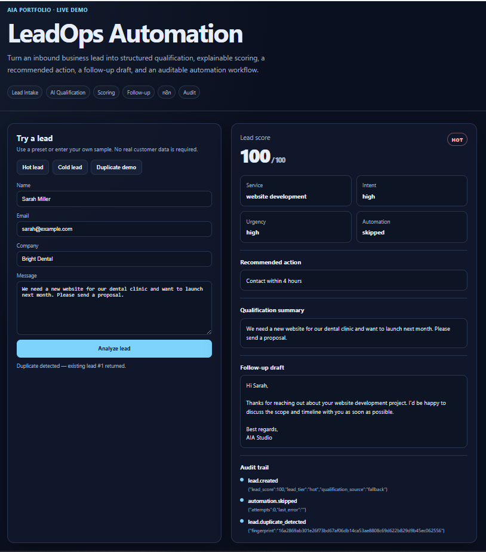

# AIA LeadOps Automation

[](https://github.com/iahai-labs/AIA_LeadOps_Automation/actions/workflows/ci.yml)

Production-minded AI lead operations and workflow automation for SMBs.

## Live Demo

**https://ai.iradhd.ir/leadops/**

The public portfolio deployment runs in a demo-safe mode:

- interactive lead processing remains available
- deterministic qualification fallback is used
- external AI calls are disabled
- external n8n delivery is disabled
- POST requests are rate limited
- the application is exposed only through the portfolio reverse proxy

The codebase still supports real OpenAI-compatible AI providers and n8n automation when enabled through private environment configuration.

## Demo Preview



The demo shows a complete lead-processing path from intake through qualification, explainable scoring, recommended action, follow-up generation, and an auditable event trail.

## Workflow

```text
Lead Intake
  -> Qualification
  -> Explainable Scoring
  -> Recommended Action
  -> Follow-up Draft
  -> Persistence
  -> Automation Boundary
  -> Audit Trail
```

## Portfolio Highlights

- FastAPI REST API
- PostgreSQL persistence
- deterministic duplicate detection
- structured AI qualification
- OpenAI-compatible provider abstraction
- safe deterministic fallback behavior
- explainable 0–100 lead scoring
- hot / warm / cold lead tiers
- recommended next actions
- follow-up generation
- n8n integration boundary
- bounded retry behavior
- automation state persistence
- audit trail
- responsive interactive demo UI
- demo-safe rate limiting
- production Docker deployment
- reverse-proxy deployment under `/leadops/`
- GitHub Actions CI
- pytest + Ruff
- Dependabot and repository security controls

## Engineering Decisions

### AI extracts signals; deterministic rules own the score

The LLM is used for structured qualification, while the final lead score is produced by transparent business rules. This keeps prioritization explainable and testable.

### AI failure does not break lead intake

If the configured AI provider is unavailable, LeadOps falls back to deterministic qualification so the lead is still accepted and processed.

### Automation failure does not lose the lead

Lead persistence happens independently of outbound workflow delivery. Automation status and failures are recorded for follow-up and auditability.

### Duplicate submissions are idempotent

A deterministic SHA-256 fingerprint is used to detect repeated submissions and return the existing lead instead of creating another record.

### Public demo mode is intentionally cost-safe

The deployed portfolio demo keeps the real production integration boundaries in the codebase while disabling uncontrolled external AI and n8n calls. This allows recruiters and clients to interact with the system without creating API-cost or automation-abuse risk.

## Local Demo

```bash
uvicorn app.main:app --reload --port 8002
```

Open:

`http://127.0.0.1:8002/`

Swagger:

`http://127.0.0.1:8002/docs`

## Production Deployment

The live demo is deployed behind the existing portfolio reverse proxy:

```text
https://ai.iradhd.ir/leadops/
        |
        v
central nginx reverse proxy
        |
        v
127.0.0.1:8002
        |
        v
LeadOps API container
        |
        v
PostgreSQL
```

The application port is bound only to VPS loopback and is not exposed directly to the public internet.

## Documentation

- [`docs/architecture.md`](docs/architecture.md)
- [`docs/portfolio-case-study.md`](docs/portfolio-case-study.md)
- [`docs/phase-8/DEPLOYMENT.md`](docs/phase-8/DEPLOYMENT.md)

## Quality Gates

Before release:

```bash
python -m ruff check .
python -m pytest -q
```

CI runs automatically on pushes and pull requests.

## Release History

- `v0.1.0` — Lead intake foundation
- `v0.2.0` — Structured AI qualification
- `v0.3.0` — Explainable lead scoring
- `v0.4.0` — Automation integrations
- `v0.5.0` — Reliability, audit, and demo endpoints
- Demo UI — interactive portfolio presentation layer
- Production deployment — live under `/leadops/`
- `v1.0.0` — production-ready portfolio release
